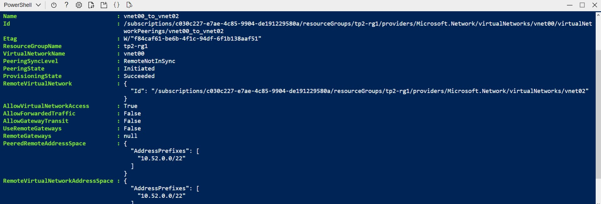

## Compte rendu du TP n° 2 : Les réseaux virtuels

### Réalisé par Fourati Aymen & Helali Eya

## Task 1
### 1 

### 2

### 3

### 4

### 5

### 6

### 7

### 8 

### 9

### 10 

### 11

### 12

## Task 2
### 3

### 4

### 5

### 6

### 7

### 8 

### 9

### 10

### 11

### 12

### 13

### 16

### 17

### 18 

### 19

### 21

### 22

### 23

